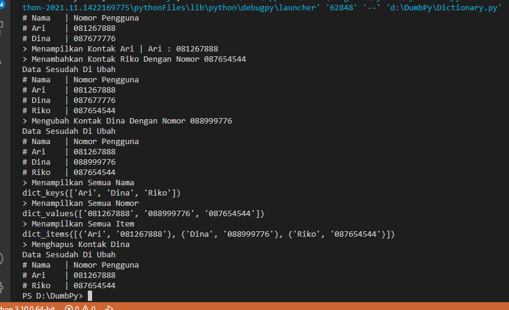
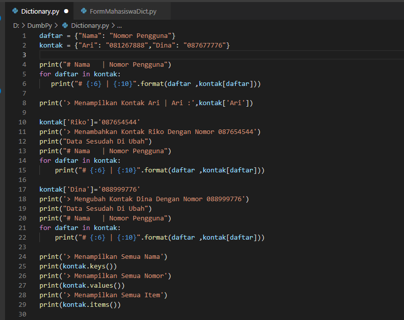
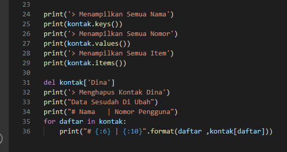

# Lab5
# Latihan 1
## Ini Adalah Hasil dari Latihan 1

## Dengan Berikut kodenya
Untuk bisa menampilkan semua isi dari sebuah dictionary saya memanfaatkan guna perulangan
#### for daftar in kontak:
   print("# {:6} | {:10}".format(daftar ,kontak[daftar]))
#### Menggunakan fungsi print(kontak['Ari']) untuk memunculkan value dari key Ari
#### Menggunakan fungsi print(kontak.keys()) untuk memunculkan keys yang ada
#### Menggunakan fungsi print(kontak.values()) untuk memunculkan values yang ada
#### Menggunakan fungsi print(kontak.items()) untuk memunculkan keys dan values yang ada

