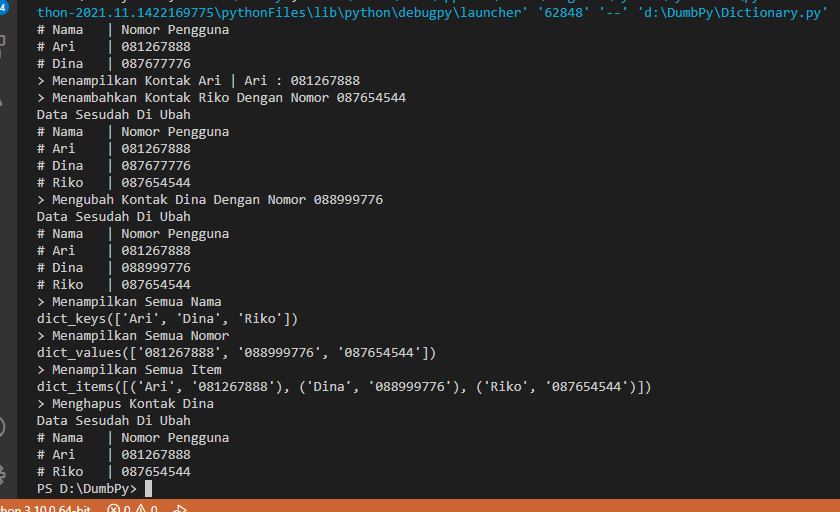
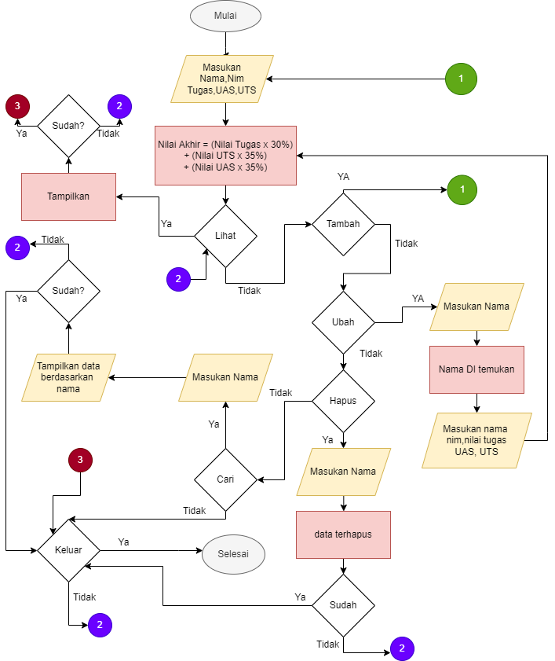
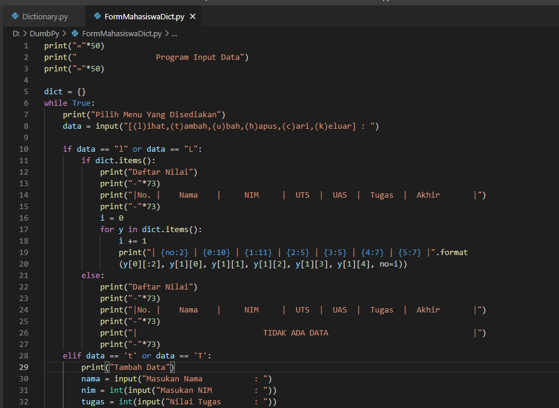
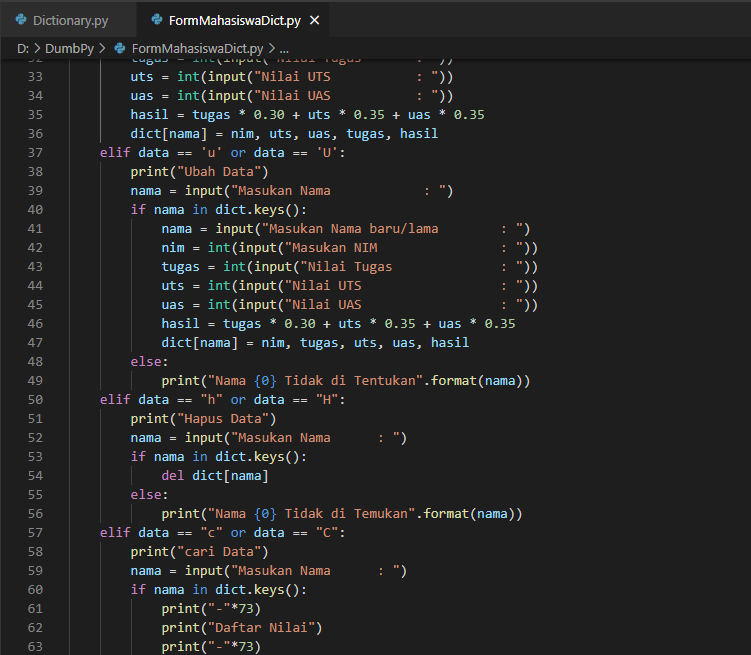
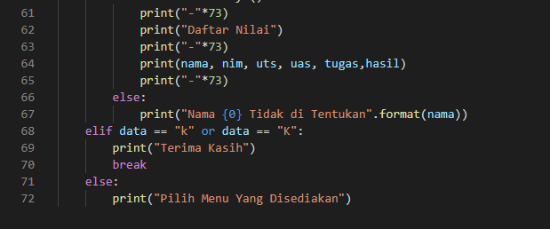
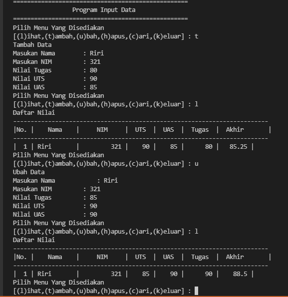
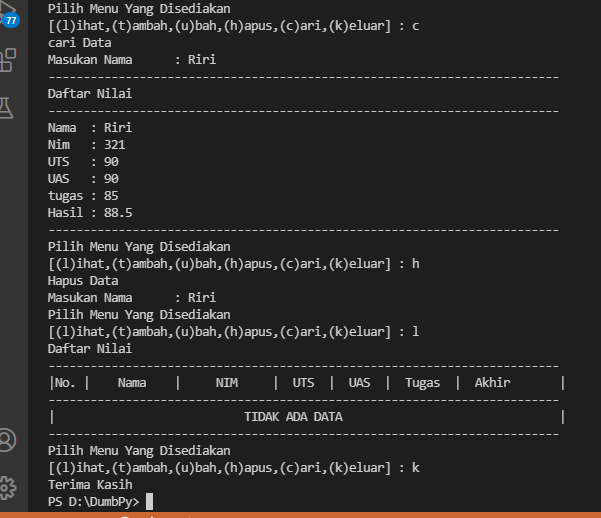

# Lab5
# Latihan 1
## Ini Adalah Hasil dari Latihan 1

## Dengan Berikut kodenya
Untuk bisa menampilkan semua isi dari sebuah dictionary saya memanfaatkan guna perulangan
for daftar in kontak:
   print("# {:6} | {:10}".format(daftar ,kontak[daftar]))
#### Menggunakan fungsi print(kontak['Ari']) untuk memunculkan value dari key Ari
#### Menggunakan fungsi print(kontak.keys()) untuk memunculkan keys yang ada
#### Menggunakan fungsi print(kontak.values()) untuk memunculkan values yang ada
#### Menggunakan fungsi print(kontak.items()) untuk memunculkan keys dan values yang ada

# Praktikum 5
## Program Menginput Data Mahasiswa
Ini adalah menggunakan program Menginput Data Mahasiswa menggunakan fungsi Lihat, Tambah, Ubah, Hapus, Cari, Keluar
### Cara kerja program
Ketika di run Program menyediakan menu menu yang bisa anda pilih seperti 
#### "T" untuk fungsi Tambah
guna fungsi tambah, kita di minta untuk menginput Nama, Nim, Nilai Tugas, Nilai UTS, Nilai UAS lalu program akan menyimpan datanya di dictionary untuk melihat hasil
#### "L" untuk fungsi lihat
guna fungsi lihat untuk melihat list dengan data yang tersimpan
#### "U" untuk fungsi Ubah
guna fungsi ini untuk mengubah data jika ada kesalahan saat input
#### "H" untuk fungsi Hapus
guna fungsi ini untuk menghapus data yang sudah kita input
#### "C" untuk fungsi Cari
guna fungsi ini untuk mencari data spesifik dengan nama yang kita input
#### "K" untuk fungsi Keluar
guna fungsi ini untuk keluar dari program

### Berikut Bentuk Flowchart nya

### Berikut Bentuk Code nya

### Berikut Bentuk Hasil Code nya

